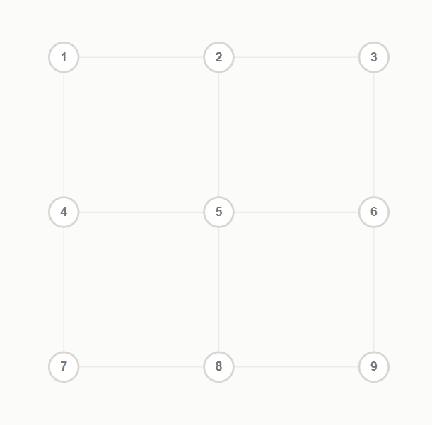
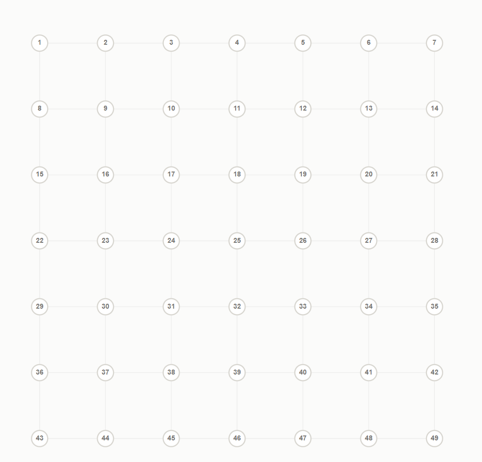

# The Most Complicated Lock Pattern Game

A standalone frontend puzzle about drawing Android-style lock patterns that cover every possible line slope in a square grid.

Live site target:

```text
https://tl2cents.github.io/lock-game/
```

Concept link: https://www.youtube.com/watch?v=PKjbBQ0PBCQ. 

> I really enjoyed that video and the math behind the lock patterns. Then, I ask my agent (Codex + GPT-5.5) to implement the game as a static website, and it turned into this project. Hope you enjoy this game and I strongly recommend you to watch the video after playing the game.


## Demo

### Easy Demo



### Crazy Demo



## What It Does

The game runs entirely in the browser. All pattern validation, intermediate-point checks, slope calculation, slope coloring, sample playback, and win checking are implemented in TypeScript under `src/lib/lockRules.ts`.

Players can choose a `3x3`, `5x5`, or `7x7` grid, then draw or click through a lock pattern. The goal is to use every unique slope available in the chosen grid at least once without reusing points.

## Rules

1. Each point may be used at most once.
2. A long straight jump is legal only after every intermediate point on that exact line has already been selected.
3. The goal is to use every unique slope available in the chosen grid at least once.

## Available Grids

| Grid | Points | Unique slopes | Difficulty |
| --- | ---: | ---: | --- |
| 3x3 | 9 | 8 | Starter |
| 5x5 | 25 | 24 | Strategic |
| 7x7 | 49 | 48 | Extreme |

## Local Development

Requirements:

- Node.js 22 or newer
- npm

Install dependencies:

```bash
npm ci
```

Run the local dev server:

```bash
npm run dev
```

Open:

```text
http://localhost:3000
```

Run checks:

```bash
npm run check
```

Build the static site:

```bash
npm run build
```

The static output is written to `out/`.